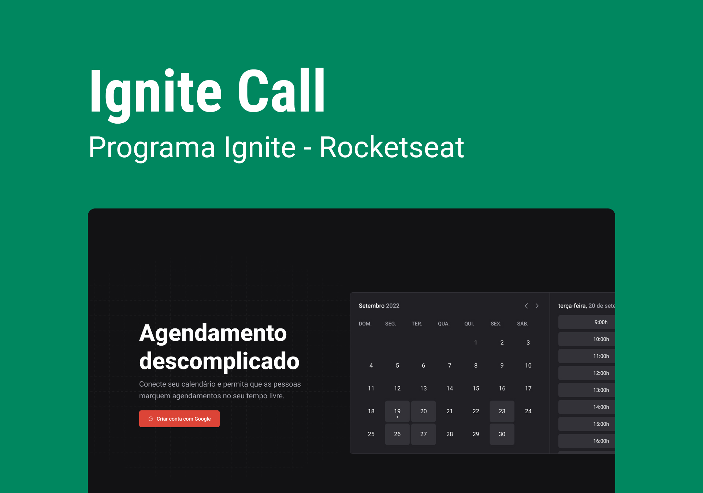

<h1 align="center"> Ignite Design System </h1>

  Quinto projeto desenvolvido durante o bootcamp Ignite da Rocketseat.

  <a href="#-tecnologias">Tecnologias</a>&nbsp;&nbsp;&nbsp;|&nbsp;&nbsp;&nbsp;
  <a href="#-projeto">Projeto</a>&nbsp;&nbsp;&nbsp;|&nbsp;&nbsp;&nbsp;
  <a href="#-layout">Layout</a><!-- &nbsp;&nbsp;&nbsp;|&nbsp;&nbsp;&nbsp;
  <a href="#-como-executar">Como executar</a> -->

 

  

## 💻 Projeto

Esse projeto é um Design System que será utilizado na aplicação Ignite Call. O Ignite Call será o sexto projeto desenvolvido durante o bootcamp Ignite da Rocketseat.

Componentes criados para esse Design System:
- [ ] Text
- [ ] Heading
- [ ] Box
- [ ] Button
- [ ] TextInput
- [ ] TextArea
- [ ] Checkbox
- [ ] Avatar
- [ ] MultiStep

## ✨ Tecnologias

Esse projeto foi desenvolvido com as seguintes tecnologias:

- Figma
- React
- Stitches
- Storybook
- Turborepo
- Changeset
- tsup
- npm workspaces

## 🚀 Como executar

Para executar a aplicação é necessário usar os seguintes comandos no terminal:
- `npm install` para instalar as dependências da aplicação.
- `npm run dev` para executar a aplicação.

## 🔖 Layout

Você pode visualizar o layout do projeto através [DESSE LINK](https://www.figma.com/file/1PEntbO58FyqdO8gUSDgwZ/Ignite-Call?node-id=0%3A1&t=DADYLvYcw9d5LA8l-1).
